# Testing

testing işlemleri için birçok senaryo oluşturup sistemi test ettim.

## TXT Testi

en basit işlenebilir format txt olduğundan ilk bununla başladım. Bu eşiği geçtiğim anda en az basit bir RAG sistemi yapmış olduğumu doğruladım.

Gemini üzerinden 3 sayfalık bir hikaye yazdırdım. sistem bana sorabileceğim soruları çıkardı. Bir tane anlamsal bir tane de metin üzerinden aratarak çıkarabileceği soru sordum.

Soru 1: Ana karakter, güvenlik görevlisini etkisiz hale getirmek için ne kullanmıştır?

Cevap 1: Ana karakter, güvenlik görevlisini etkisiz hale getirmek için **yangın söndürme tüpünü** kullanmıştır. Güvenlik görevlisi konteyner merdiveninden başını çıkardığı anda tüpü yüzüne doğru boşaltmış, adam sendelediğinde tüpü göğsüne fırlatıp merdiven kapağını üzerine kilitlemiştir. **Kaynak: son_sevkiyat_aksiyon.txt, sayfa 1, parça 6**.

Analiz 1: Sistem basit RAG gereksinimlerini karşılıyor. Yangın söndürme tüpü ifadesinin geçtiği chunk'ı hem 0.493 dense skoruyla hem de 9.454 BM25 skoruyla buldu. Burada sorulan soru metinde geçen ilgili kısımla ortak kelimeler içeriyor.

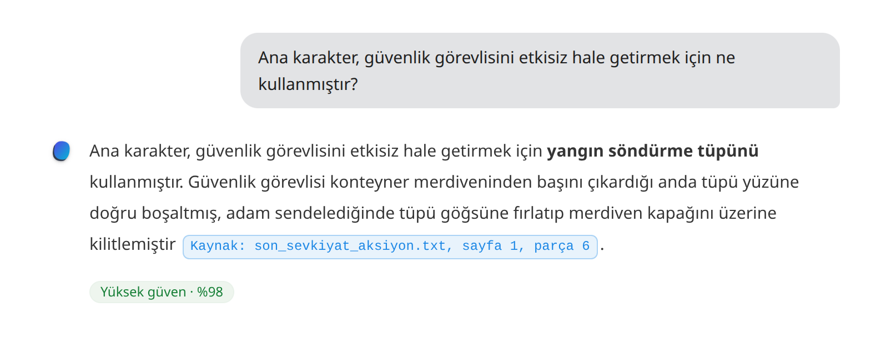

Soru 2: Diskin üzerindeki numara neydi?

Cevap 2: Diskin üzerindeki seri numarası **"Proje-88: Sevkiyat ve Koordinat Defteri"** idi. **Kaynak: son_sevkiyat_aksiyon.txt, sayfa 1, parça 6.**

Analiz 2: Burada da bilerek doğal dilde bir soru sordum. Metinde bu kısmın geçtiği yerdeki dil kullanımından biraz farklı. Yine ilgili chunk'ı güçlü bir şekilde buldu. 0.525 dense skoru, 5.303 BM25 skoruyla buldu.

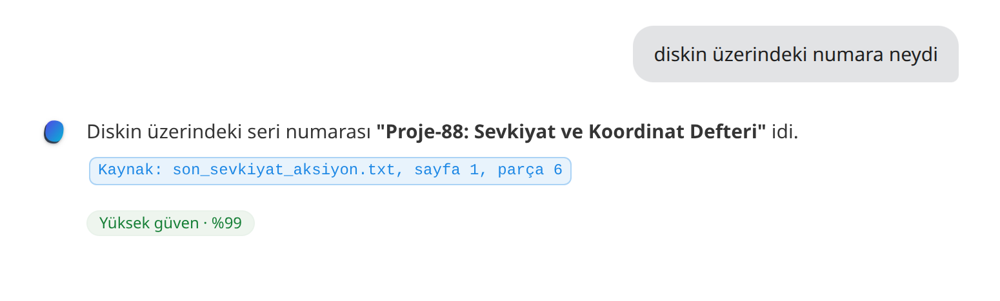

## Resim Testi

Resim kısmında iki tane test yapacağım. Birincisi OCR test, ikincisi vision LLM test.

ocr testi için bir kitabın taranmış sayfasını kullandım.

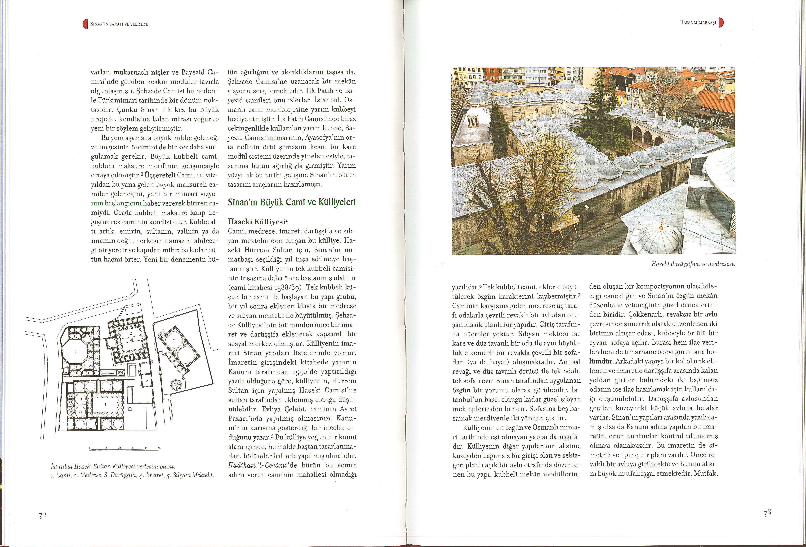

Bu belgedeki yazı yoğunluğu OCR koşullarında kaldığı için vision llm'e göndermeden daha maliyetsiz bir şekilde direkt OCR ile yazıya çevireceğiz.

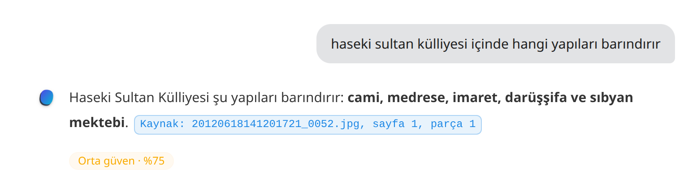

Görüldüğü gibi sorulan soruyu düzgün bir şekilde cevaplayabiliyor.

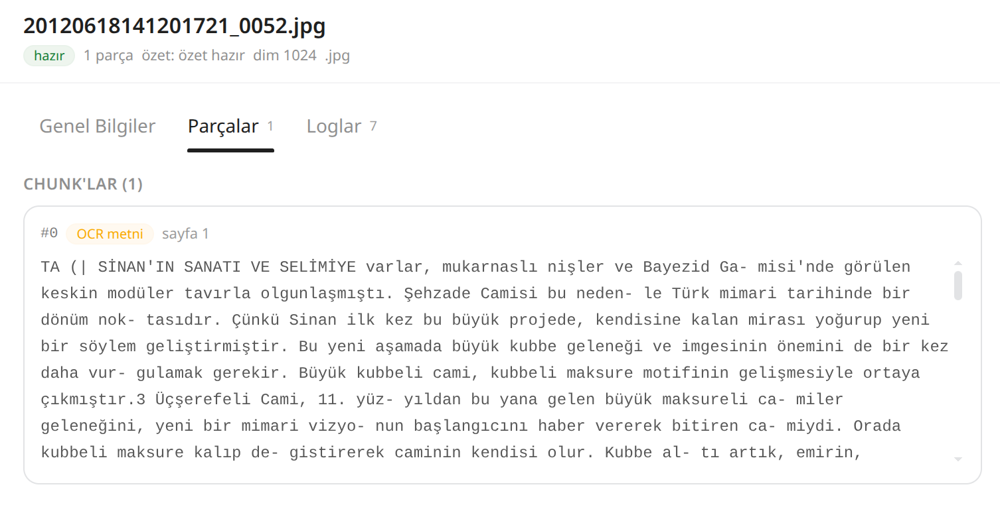

Burada da ocr'dan gelen metni görüyoruz. Şu anda sistem tekil resimden çok yüksek miktarda veri çekmeyeceği için ocr'dan gelen metni tekrar chunklama yapmıyor. ama bu sistem de basit bir şekilde eklenebilir.

Vision LLM testi için içinde çok yazı geçmeyen bir fotoğraf kullanacağız.

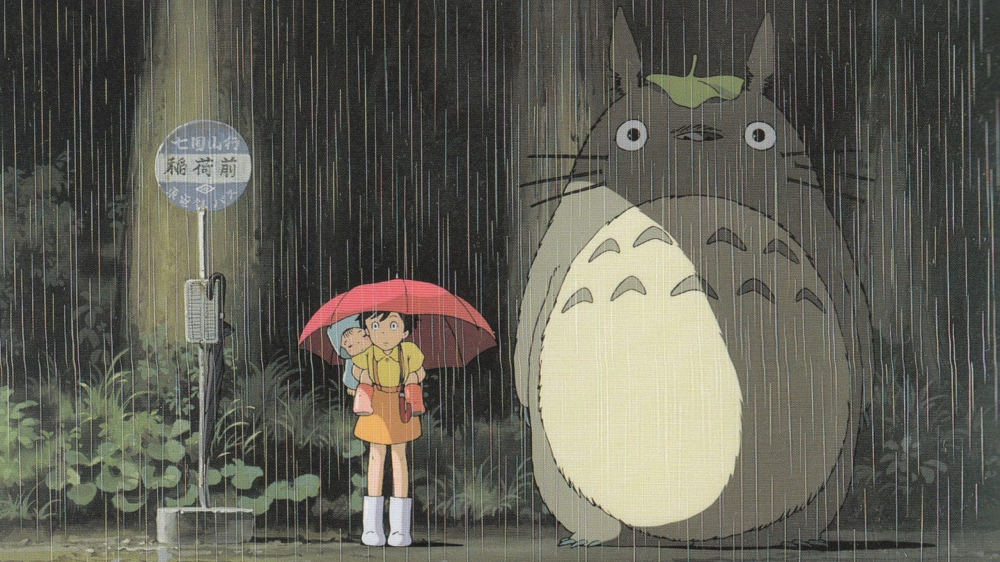

Soru: Fotoğraftaki şemsiye ne renktir?

Cevap: Fotoğraftaki şemsiye kırmızı renktedir. **Kaynak: cropped-my-neighbor-totoro-full_-342683.jpg, sayfa 1, parça 1**

Analiz: Burada prompt yeteneğini kullanıyoruz ve fotoğrafı vision llm'e göndererek fotoğrafı birisine tarif etmeye çalışsaydın nasıl yapardın, bu fotoğraftan ne kadar bilgi çıkarabilirsin şeklinde soruyoruz. Fotoğraftaki gördüğü tüm detayları metin olarak döndürüyor. Biz de bu metin üzerinden soru soruyoruz.

## PDF Testi

Pdf bu sistemin en kompleks tarafı. Elimde coğrafya pdf'i var. Bu pdf üzerinden hem metin okuma becerisini, hem pdf içindeki görselleri tespit edip vision llm'e gönderme becerisini test etmiş olacağız.

Soru 1: Volkanik platolar nasıl oluşur?

Cevap 1: Volkanik platolar, lav tabakalarının akarsular tarafından parçalanmasıyla oluşur **Kaynak: folyo-gorsel-test.pdf, sayfa 1, parça 3**.

Analiz 1: Burada basit bir metin extract işlemini test ettik. Bunu başarıyla geçiyor. **Dense kosinüs** 0.671, **BM25 ham** 22.744 şeklinde skorlar elde ediyor.

Soru 2: Trabzon'da deprem riski nedir?

Cevap 2: Trabzon'da deprem riski **azdır**. Karadeniz Bölgesi'nin kuzey kesimleri (kıyılar) depremin az olduğu alanlar arasında sayılmıştır **Kaynak: folyo-gorsel-test.pdf, sayfa 2, parça 8**. Ayrıca Türkiye Deprem Tehlike Haritası'nda Trabzon ve çevresi "Risk az!" olarak işaretlenmiştir.

Analiz 2: Burada sadece metni okumakla kalmamış görseli de vision llm'e göndermiş ve Trabzon üzerindeki risk az yazısını trabzon'la ilişkilendirmiş. Başarıyla testten geçtiğini görüyoruz. 

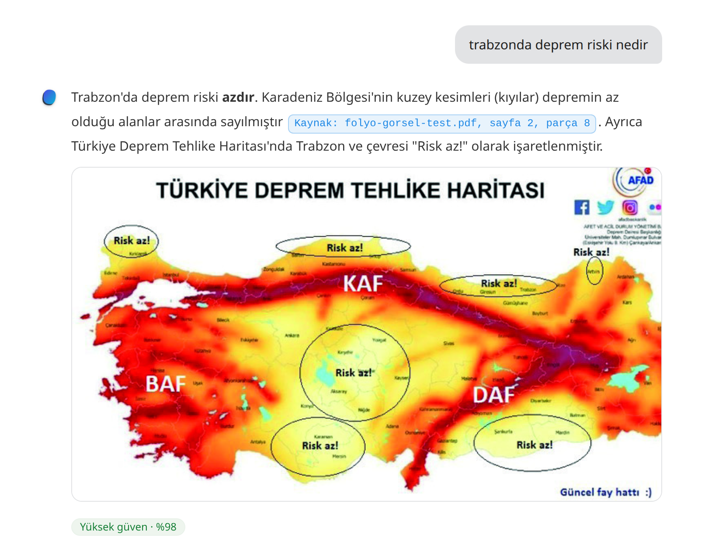

Bu pdf içerisinde iki sayfa var ve birinde platolar birinde deprem bölgelerini gösteren farklı iki harita var. Şimdi bu iki bilgiyi kullanarak pdf'te olmayan bir bilgiyi PDF'te olan bilgileri kullanarak üretebiliyor mu buna bakalım.

Soru 3: Deprem riski yüksek olan platolar hangileridir?

Cevap 3: Deprem riski yüksek olan platolar, belgelerde **depremin az olduğu alanlar** arasında sayılmayan ve aktif fay hatlarına yakın konumda bulunan platolardır. Aşağıdaki listeyi oluştururken platoların türleri **Kaynak: folyo-gorsel-test.pdf, sayfa 1, parça 3** ile az riskli alanlar **Kaynak: folyo-gorsel-test.pdf, sayfa 2, parça 8** ve deprem tehlike haritası  kaynakları birleştirilmiştir.

**Yüksek riskli platolar:**

- **Volkanik Platolar:** Erzurum‑Kars Platosu, Ardahan Platosu (Doğu Anadolu Fayı yakınında, düşük risk alanlarında listelenmemiştir)
- **Karstik Platolar:** Teke Platosu (Taşeli Platosu düşük riskli iken Teke için böyle bir belirtme yoktur; Akdeniz Bölgesi’nde aktif faylar bulunur)
- **Tabaka Düzlüğü Platoları:** Haymana, Bozok, Uzunyayla, Yazılıkaya (Ege iç kesimler) (bu platolar düşük risk bölgelerinde sayılmamıştır; Haymana Ankara yakınında KAF’a, Yazılıkaya BAF’a yakındır)
- **Aşınım Platoları:** Çatalca‑Kocaeli Platosu’nun **Kocaeli** kesimi (Perşembe Platosu düşük riskli iken Kocaeli fay hattı üzerindedir; Çatalca kısmı ise kısmen düşük risk alanına girebilir)

**Not:** Depremin az olduğu alanlar listesinde yer alan **Taşeli Platosu** (Akdeniz), **Şanlıurfa ve Gaziantep Platoları** (Güneydoğu), **Cihanbeyli ve Obruk Platoları** (Konya‑Karaman yöresi) ile **Perşembe Platosu** (Ordu) düşük riskli kabul edilir. **Kaynak: folyo-gorsel-test.pdf, sayfa 2, parça 8**

Analiz 3: Sistem başarılı bir şekilde iki farklı resim bilgisini birleştirerek yeni bir çıkarımda bulunabilmiştir.

Bir sonraki testte bir tarifteki malzemelerinin olduğu pdf'te porsiyon miktarını değiştirdiğimde malzemeleri doğru tahmin edebiliyor mu bunu ölçtüm.

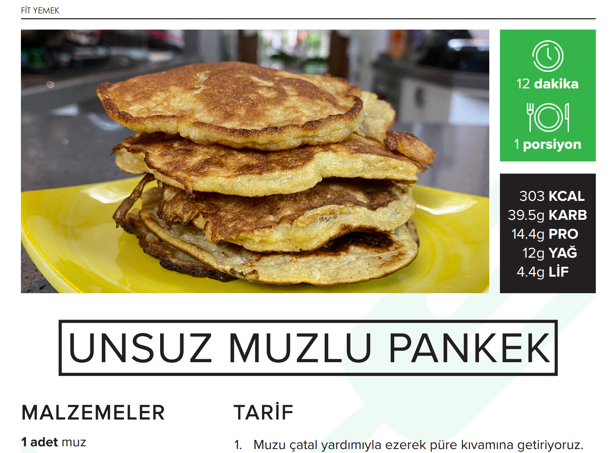

Soru 4: 2 porsiyon unsuz muzlu pankek için ne kadar muz gerekir?

Cevap 4: 2 porsiyon unsuz muzlu pankek için **2 adet muz** gerekir.

- Temel tarif 1 porsiyon içindir ve **1 adet muz** kullanılır **Kaynak: Fit-Tarifler-Fit-Yemek-Emre-GOKGOZ-93ntwm.pdf, sayfa 1, parça 6**.
- Tarifin toplam süresi 12 dakika ve 1 porsiyondur **Kaynak: Fit-Tarifler-Fit-Yemek-Emre-GOKGOZ-93ntwm.pdf, sayfa 1, parça 1**.
- Aynı tarifin 2 porsiyonluk versiyonu da bulunur (8 dakika, 2 porsiyon) **Kaynak: Fit-Tarifler-Fit-Yemek-Emre-GOKGOZ-93ntwm.pdf, sayfa 3, parça 19**.

2 porsiyon, 1 porsiyonun iki katı olduğundan, muz miktarı da iki katına çıkar: 1 adet × 2 = **2 adet muz**.

## Tablo Testi

tablo testi için sistem ösym sonuç belgesi girdim. belgedeki toplam TYT netini sordum.

Tablolar embedding aşamasında düzgün bir şekilde extract edildi ve cevabı da retrieve ederek hesaplayabildi.

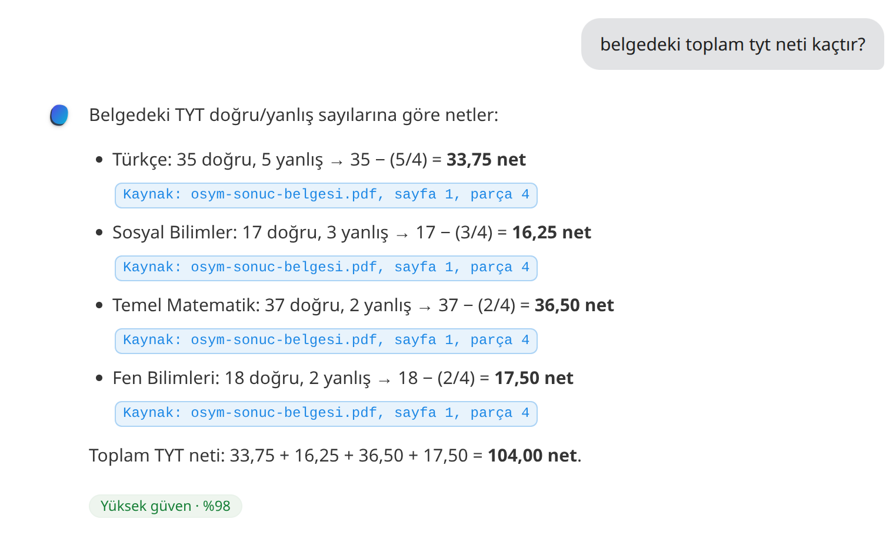

## Denklem Testi

Sisteme denklemleri latex ile üretilmiş bir helikopter teorisi ders notları pdf girdisi verip testlerimi gerçekleştirdim.

Soru: hover durumu için induced velocity formülü nedir?

Sistem gayet iyi bir şekilde pdf'teki denklemleri extract edebildi. denklemler tasarımımız sayesinde etrafındaki metni de kapsadığı için sorudan denklemi bulabildi.

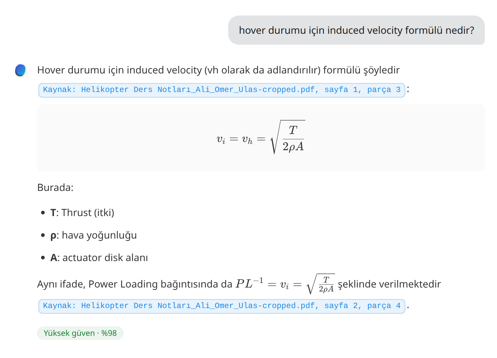

## İngilizce Testi

İngilizce testi için "**How to Invent Everything"** kitabından birkaç sayfalık bir girdi vererek soru sordum.

Soru: According to the text, why does tilting a wing beyond a certain point lead to a stall?

Cevap: Tilting the wing more deflects more air downward and increases lift **up to a certain point**. Beyond that point, the air no longer flows smoothly along the wing, causing **turbulence**, which produces **a huge reduction in lift** and results in a **stall**—and soon a falling aircraft **Kaynak: How_to_Invent_Everything-A_Survival_Guide.pdf, sayfa 2, parça 6.**

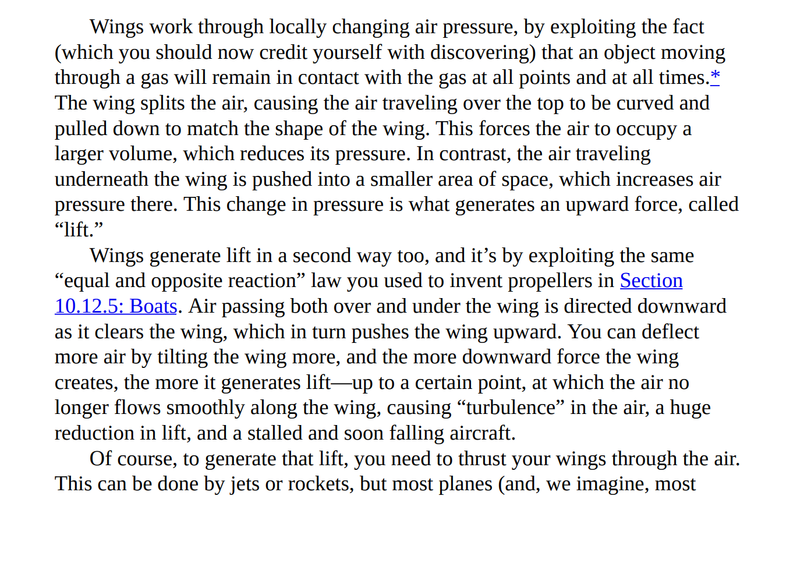

## Halüsinasyon Testi

Bu testte de "Dr. Jekyll ve Mr. Hyde" kitabının kısa bir bölümünü girdi olarak verip başka bir roman karakteriyle ilgili bir soru soracağım.

Soru: Raskolnikov’un cinayeti işleme motivasyonunun temelinde yatan, insanları "sıradanlar" ve yasa koyucu haklara sahip "olağanüstü olanlar" şeklinde ikiye ayıran felsefi kuramın adı nedir?

Cevap: Bu bilgi belgelerde yer almıyor.

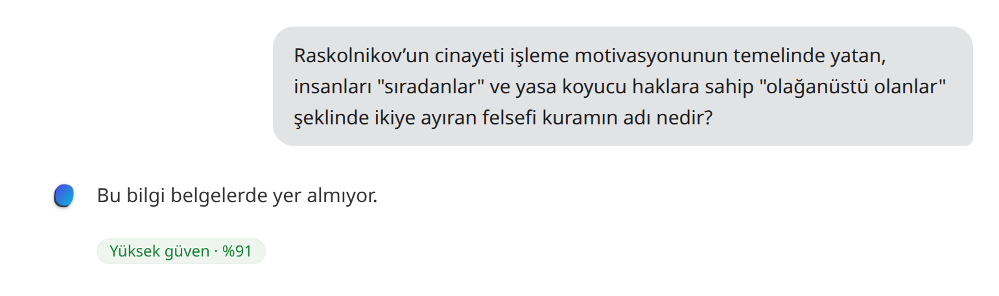

 

Görüldüğü üzere normalde deepseek modeli bu bilgiyi bilmesine rağmen hem algoritma tarafında hem de llm tarafında koyduğumuz kurallar sayesinde bilginin belgelerde yer almadığını doğruladık.

ÖNEMLİ NOT: Testlerimin sonuçlarına göre sistem RAG dahilinde kendine düşen görevi gayet iyi şekilde yapabilmektedir. Ancak token konusunda maddi olarak bütçem olmadığından "deepseek/deepseek-v4.1-flash" gibi low cost bir modelle testleri yaptım. Hesaplama kaynaklı yaşanabilecek hatalar modelden de kaynaklı olabilir.